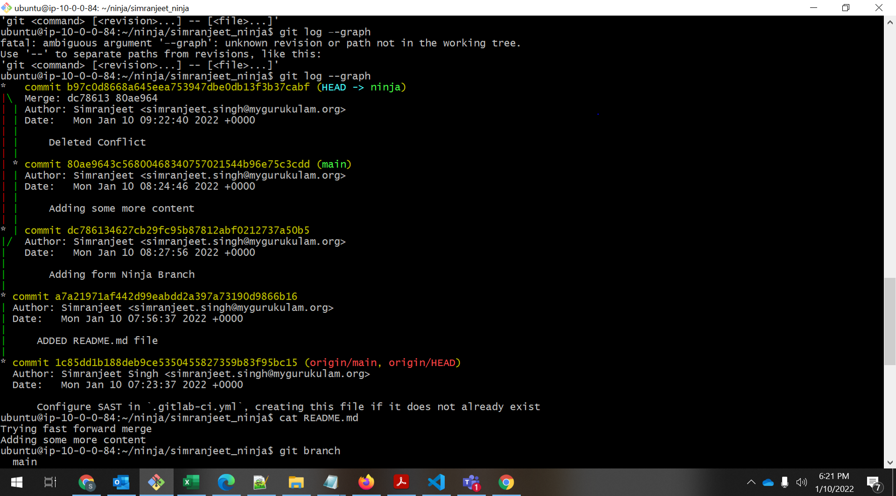
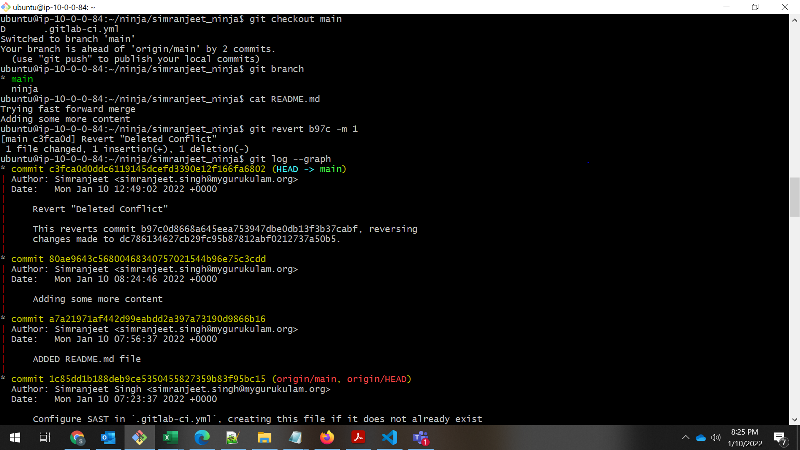

# CI/CD Assigment: DAY1

### Git Assigment
## Authors

### Simranjeet Singh
## TO DO

- Create a folder ninja at the root level of your cloned code
- Add a file README.md with content "Trying fast forward merge"
- Create a branch ninja and move to it
- Run git status command
- Commit your changes to ninja branch
- Merge ninja branch to master branch make sure that a new commit get's created
- Assuming you are in master branch, modify README.md with content Changes in master branch, commit the changes in master branch.
- Switch to ninja branch, modify README.md with content Changes in ninja branch, commit the changes in ninja branch.
- Merge master branch to ninja branch in such a fashion that changes of master branch overrides changes in ninja branch
- Revert the above merge commit
- Merge master branch to ninja branch in such a fashion that changes of ninja branch overrides changes in master branch
- Revert the above merge commit
- Merge master branch to ninja branch in such a fashion that changes of both branches gets accumulated.

As we can see in the above Snagit. We have created an folder ninja and added a README.md file 
We have tested fast forward merge and get the logs and the status.
Also we have revert the changes.

## Thanks!

